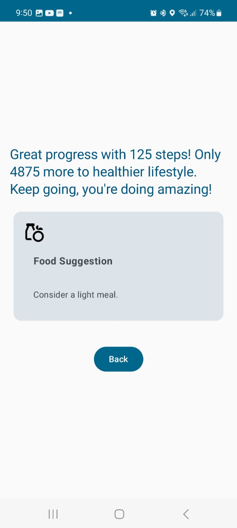

# 📱 Fitness Tracker

An Android app built in **Kotlin** with **Jetpack Compose** to track **steps, distance, calories, and sleep activity** using mobile sensors like **Accelerometer**, **GPS**, and **Step Counter**.

---

## 🚀 Features
- Step tracking with Step Counter sensor.
- Distance & speed calculation using GPS.
- Sleep status detection via accelerometer.
- Modern UI with Jetpack Compose.
- Permissions handling for location & sensors.

---

## 📷 Screenshots

### Welcome Screen

### Detailed Screen

### Suggestion Screen

---

## 🛠 Tech Stack
- **Language:** Kotlin  
- **UI:** Jetpack Compose  
- **IDE:** Android Studio  
- **SDK:** Android SDK  

---

## 📚 References
- [Android Developer Docs](https://developer.android.com/)  
- [GeeksforGeeks Android Tutorials](https://www.geeksforgeeks.org/android-tutorial/)
